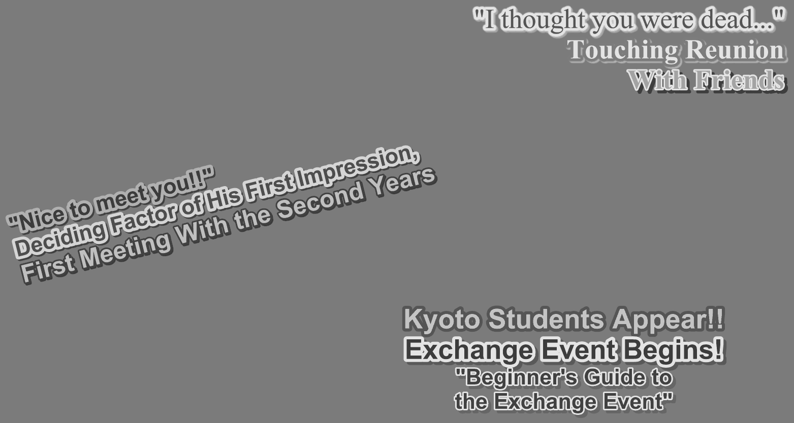
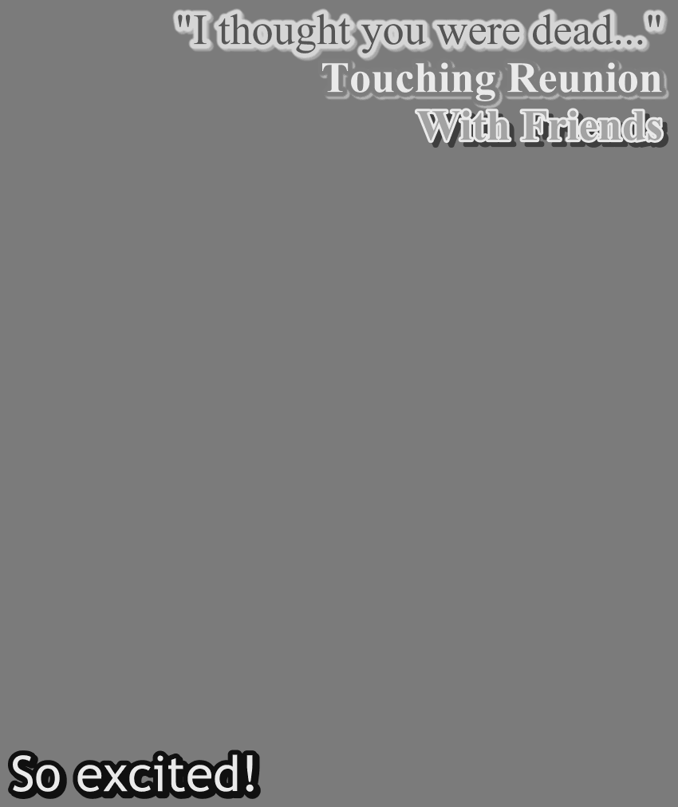

# PGS in detail

During development a couple of interesting edge-cases have been encountered which will be described here in detail.

Additionally if you are interested in understanding the PGS specification please visit this [excellent article](https://blog.thescorpius.com/index.php/2017/07/15/presentation-graphic-stream-sup-files-bluray-subtitle-format/).

Continuing further it is assumed you understand the concepts of DisplaySets, the different types of PGS Segments and some specifics like CompositionObjects & DisplayObjects. If you are unsure please read the article mentioned above first.

**A couple basics first:**

PGS match the displayed resolution, usually 1920x1080p, to display images on screen at specific timestamps. These images are entirely transparent (Alpha) and include any styling & orientation defined for each text region. See the following example from [Jujutsu Kaisen Season 1 Episode 14](https://www.imdb.com/title/tt13847654/?ref_=ttep_ep_14): 



Here the color and transparency (Alpha) was already stripped internally to aid the models in better differentiating between texts.

In PGS different segments represent the metadata used by the PGS parser to produce the required image on screen. The segments grouped into DisplaySets which can look like this once parsed:

```
DS[0]
	type=PCS, pts=00:00:33,534, dts=00:00:00,000, size=19, width=1920, height=1080, frame_rate=16, number=0, state=EPOCH_START, palette_update=False, palette_id=0, num_objects=1, composition_objects=[<sub_convert.pgs.pgs_segments.PresentationCompositionSegment.CompositionObject object at 0x7d7999ff1820>]
	type=WDS, pts=00:00:33,534, dts=00:00:00,000, size=10, num_windows=1, windows=[<sub_convert.pgs.pgs_segments.WindowDefinitionSegment.Window object at 0x7d7999ff17f0>]
	type=PDS, pts=00:00:33,534, dts=00:00:00,000, size=1277, palette_id=0, version=0
	type=ODS, pts=00:00:33,534, dts=00:00:00,000, size=12331, id=0, version=0, sequence_type=FIRST_AND_LAST, data_len=12324, width=435, height=51
	type=END, pts=00:00:33,534, dts=00:00:00,000, size=0
```

What you see here is a typical `EPOCH_START` or `START` segment which marks a group of DisplaySets that are in relationship to one another. There can be any number of DisplaySets after and the epoch lasts until the next `START` segment has been encountered. 

However, usually there is some kind of `END` segment which is not specifically defined prior to a `START`. They look something like this:

```
DS[1]
	type=PCS, pts=00:00:35,410, dts=00:00:00,000, size=11, width=1920, height=1080, frame_rate=16, number=1, state=NORMAL_CASE, palette_update=False, palette_id=0, num_objects=0, composition_objects=[]
	type=WDS, pts=00:00:35,410, dts=00:00:00,000, size=10, num_windows=1, windows=[<sub_convert.pgs.pgs_segments.WindowDefinitionSegment.Window object at 0x7d7999ff1760>]
	type=END, pts=00:00:35,410, dts=00:00:00,000, size=0
```

While `START` defines color palettes (PDS) & DisplayObjects (ODS) the `END` statement does not. Additionally `START` defines a number of CompositionObjects matching the amount of separate images (max of 2) to be displayed, which the `END` segment does not. This is important as this marks the exact timestamp a given image should vanish.

In addition to `START` & `END` statements PGS also has `NORMAL_CASE` and it's special case `ACQUISITION_POINT` as segment types. Segments between two `START` are usually either of those two types and just describe an update within the viewport by displaying a new image. An `END` segment is also `NORMAL_CASE`.

**In general:**

A image is continuously displayed as long as the following DisplaySet calls for the exact same `object_id` defined by the DisplaySet which first initialized the image. This metadata is carried within the CompositionObjects.

*However, there is an exception to this rule:* a DisplaySet can initialize another image with the same `object_id`. This effectively means the image is overwritten or updated entirely.

While color palettes can be defined new in each DisplaySet they can also be omitted, this means the prior palette is to be used again.

These combinations of segment types and DisplaySets allow for PGS to display [overlaps](#overlaps), [fades](#fades-in-out) or [cropped images](#cropped-images), which will be described further.

## Overlaps

First overlap describes PGS images overlapping by their display timestamp / time-ranges. Two images can overlap at the same time, extending shortly before or after. 

Overlaps are possible in PGS, spanning arbitrary time within an epoch, by displaying up to 2 Windows within the stream. Additionally overlaps can also be displayed by combining 2 or more text-regions within a single image.



For example with this image you can see the overlap is achieve by displaying a single, joined image, while:


In the case of [Hells Paradise Season 1 Episode 6](https://www.imdb.com/title/tt27580346/?ref_=ttep_ep_6) the effect is achieved by multiple separate images which are displayed at the same time within different regions of the viewport.

Looking at the [timeline-view](design/implementation#timelines) you can clearly see the different [TimelineItems](design/subtitle/timeline.md) for both the top and bottom halves of the screen overlapping.


For details on how this behavior is handled visit the [Implementation details](design/implementation.md#implementation-details) section.

## Fades (In / Out)

Fades, both ins and outs, are produced by chaining multiple `ACQUISITION_POINTS` in quick succession, which describe the same image but in different versions of 1 to N until the fade is completed. The images only differ in their transparency (Alpha) so for a fade in the (Alpha) increase while decreasing for a fade out. A fade usually only lasts 1 to 2 seconds but can define 50 or more images within this timeframe.

For details on how this behavior is handled visit the [Implementation details](design/implementation.md#implementation-details) section.

## Run-length encoding

## Image palettes

## Cropped images

Has not been encountered yet but theoretically PGS can crop an image to a specific size and expand it to the full size upon the next display update to "uncover" text continuously.